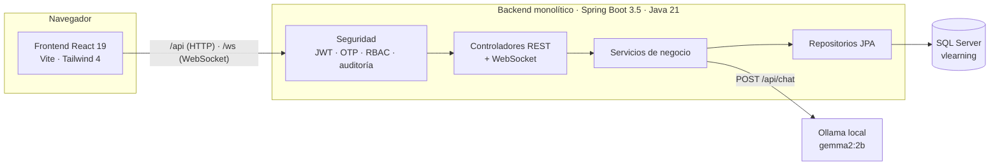
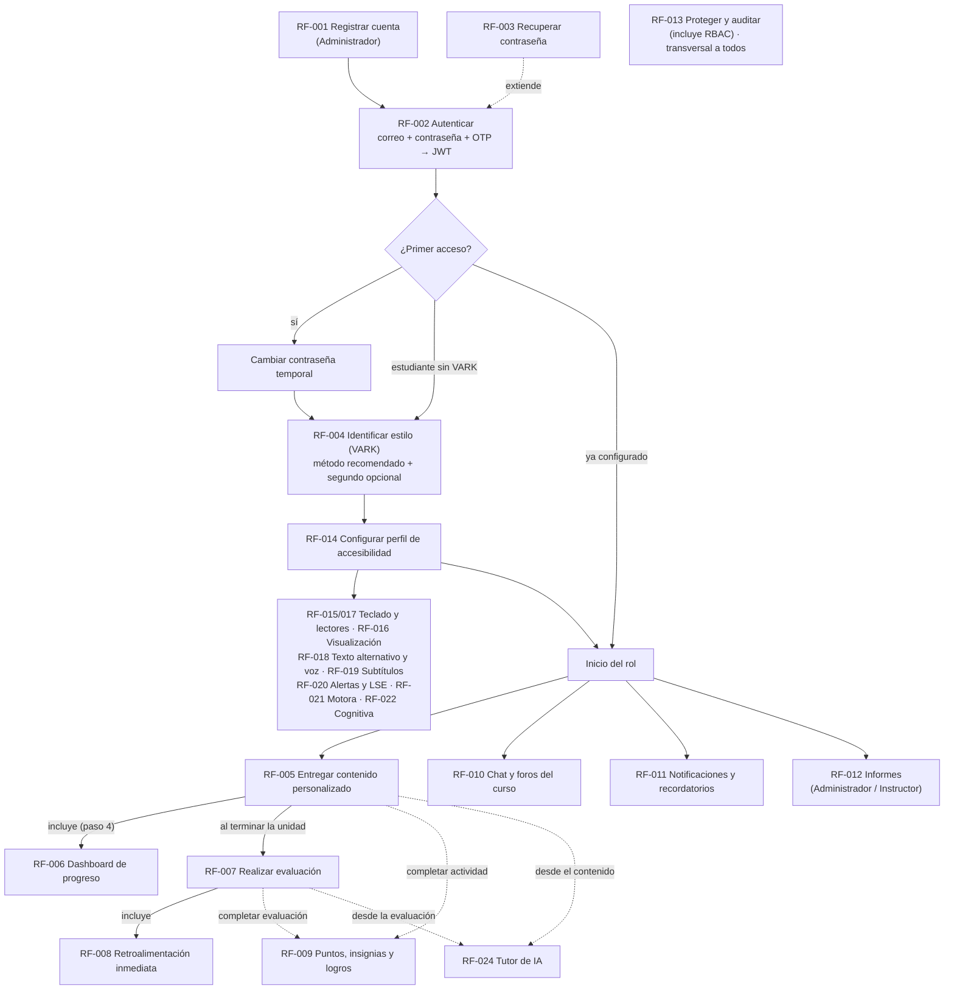

# V-Learning · LMS inclusivo con método VARK y accesibilidad


**V-Learning** es una plataforma LMS (sistema de gestión del aprendizaje) que adapta la experiencia de cada estudiante en tres ejes que trabajan juntos:

1. **Método de aprendizaje (VARK):** prioriza los formatos de contenido (video, podcast, lectura, simulación) según el método recomendado del estudiante y, opcionalmente, un segundo método.
2. **Perfil de accesibilidad:** ajusta interfaz, contenidos y actividades para personas con discapacidad **visual, auditiva, motora o cognitiva**.
3. **Tutor de IA:** acompaña al estudiante con respuestas en texto, adaptadas **solo** a su perfil de accesibilidad (RF-024: el Tutor no usa VARK).

Proyecto de aula · Tecnológico de Antioquia I.U. · Autores: Manuela Bolívar Sánchez, Juan Esteban Martínez, Juan José Cardona.

> **Estado de este README:** documento de la Fase 1. Las imágenes de `docs/img/` se generan con los prompts de la sección [12](#12-imágenes-del-readme-prompts-para-generarlas). Hasta entonces los enlaces a imágenes aparecerán rotos; es lo esperado.

---

## Tabla de contenido

1. [Objetivos](#1-objetivos)
2. [Arquitectura monolítica](#2-arquitectura-monolítica)
3. [Stack tecnológico](#3-stack-tecnológico)
4. [Estructura de carpetas](#4-estructura-de-carpetas)
5. [Requisitos](#5-requisitos)
6. [Guía paso a paso](#6-guía-paso-a-paso)
7. [Cuentas de demostración](#7-cuentas-de-demostración)
8. [Flujo del sistema según los diagramas de casos de uso](#8-flujo-del-sistema-según-los-diagramas-de-casos-de-uso)
9. [Mapa de historias de usuario → módulos y endpoints](#9-mapa-de-historias-de-usuario--módulos-y-endpoints)
10. [Endpoints por rol](#10-endpoints-por-rol)
11. [Decisiones de diseño](#11-decisiones-de-diseño)
12. [Imágenes del README: prompts para generarlas](#12-imágenes-del-readme-prompts-para-generarlas)
13. [Accesibilidad (WCAG 2.1 AA)](#13-accesibilidad-wcag-21-aa)
14. [Solución de problemas](#14-solución-de-problemas)

---

## 1. Objetivos

**Objetivo general (OBJ):** implementar una plataforma LMS de aprendizaje personalizado, adaptativo e inclusivo que ajuste contenidos, recursos y experiencia a las preferencias, necesidades de accesibilidad y progreso de cada estudiante.

**Objetivos específicos**

| # | Objetivo | Dónde se cumple |
|---|---|---|
| OBJ-1 | Acceso controlado, trazable y accesible | RF-001 a RF-003, RF-013, RF-014 a RF-022 |
| OBJ-2 | Personalizar según el perfil del estudiante | RF-004, RF-005 |
| OBJ-3 | Visibilidad del avance | RF-006, RF-011, RF-012 |
| OBJ-4 | Medir el aprendizaje de forma adaptativa | RF-007, RF-008 |
| OBJ-5 | Motivación y compromiso | RF-009 |
| OBJ-6 | Colaboración y acompañamiento | RF-010, RF-024 |

---

## 2. Arquitectura monolítica

Un solo repositorio, un solo backend (Spring Boot) y un solo frontend (React). La base de datos es SQL Server; el Tutor de IA corre en un Ollama local.




*En desarrollo, Vite hace proxy de `/api` y `/ws` hacia `http://localhost:8080`, así no hay problemas de CORS.*

---

## 3. Stack tecnológico

| Capa | Tecnología |
|---|---|
| Backend | Spring Boot 3.5.x, Java 21, Maven (`mvnw`), Spring Security, Spring Data JPA, Validation, WebSocket |
| Seguridad | JWT (jjwt 0.12.7), BCrypt, OTP de 6 dígitos, RBAC con `@PreAuthorize` |
| Documentos | Apache POI (Excel), OpenPDF 1.3.x (PDF) |
| API docs | springdoc-openapi 2.8.9 (Swagger UI) |
| Base de datos | Microsoft SQL Server (T-SQL), `mssql-jdbc`; el esquema lo crea `database/01_schema.sql` (Hibernate con `ddl-auto=none`) |
| Frontend | React 19, Vite 8, Tailwind 4 (`@tailwindcss/vite`), react-router-dom 7, axios, lucide-react |
| Fuentes | Atkinson Hyperlegible Next (por defecto), Lexend (modo dislexia), sistema |
| IA | Ollama local (`gemma2:2b`; alternativas `qwen2.5:1.5b`, `llama3.2:1b`), solo texto |

---

## 4. Estructura de carpetas

```
v-learning-platform/
├─ README.md
├─ package.json
├─ database/
│  └─ 01_schema.sql                  Esquema T-SQL (ampliaciones marcadas [EXT])
├─ docs/
│  └─ img/                           Imágenes del README (sección 12)
├─ backend/learning-platform/        Monolito Spring Boot
│  ├─ pom.xml · mvnw
│  └─ src/main/java/com/elearning/platform/
│     ├─ config/                     Seguridad, CORS, WebSocket, asincronía, propiedades
│     ├─ controller/                 Controladores finos (auth, admin, instructor, estudiante…)
│     ├─ dto/                        Objetos de petición/respuesta
│     ├─ entity/                     Entidades JPA (nombres del diagrama de clases)
│     ├─ enums/                      Enumeraciones idénticas a los CHECK del SQL
│     ├─ exception/                  ApiException + GlobalExceptionHandler
│     ├─ repository/                 Repositorios Spring Data
│     ├─ security/                   Filtro JWT, sesiones, auditoría
│     ├─ services/                   Lógica de negocio
│     └─ util/                       Utilidades (hash, normalización de texto…)
└─ frontend/                         React + Vite
   └─ src/
      ├─ components/                 Sidebar, Topbar, tarjetas, chat del Tutor…
      ├─ context/                    Prefs, Auth, Notificaciones, Tutor
      ├─ pages/                      Una por pantalla y rol
      ├─ api/                        Cliente axios
      └─ assets/                     logo.svg, react.jpg, scrum.jpg, ux.jpg
```

---

## 5. Requisitos

| Herramienta | Versión |
|---|---|
| JDK | 21 |
| Node.js | 20 o superior |
| SQL Server + SSMS | 2019 o superior (puerto 1433, autenticación SQL habilitada) |
| Ollama | Última versión (solo para el Tutor de IA) |

---

## 6. Guía paso a paso

### 6.1 Base de datos

1. Abre SSMS y conéctate a tu instancia.
2. Abre `database/01_schema.sql` y ejecútalo completo. **Borra y recrea** la base `vlearning`.
3. Crea el usuario de la aplicación y bloquea la modificación de la auditoría (bloque comentado al final del script).

### 6.2 Backend

Define las variables de entorno y arranca:

```powershell
# Windows (PowerShell)
$env:DB_USER="vlearning_app"
$env:DB_PASSWORD="<tu-contraseña>"
$env:JWT_SECRET="<cadena-aleatoria-de-al-menos-32-caracteres>"
cd backend/learning-platform
./mvnw spring-boot:run
```

```bash
# Linux / macOS
export DB_USER=vlearning_app DB_PASSWORD='<tu-contraseña>' JWT_SECRET='<cadena-aleatoria-32+>'
cd backend/learning-platform && ./mvnw spring-boot:run
```

| Variable | Obligatoria | Por defecto |
|---|---|---|
| `DB_USER` / `DB_PASSWORD` | Sí | — |
| `DB_URL` | No | `jdbc:sqlserver://localhost:1433;databaseName=vlearning;encrypt=true;trustServerCertificate=true` |
| `JWT_SECRET` | Sí | — |
| `OLLAMA_URL` / `OLLAMA_MODEL` | No | `http://localhost:11434` / `gemma2:2b` |
| `SPRING_MAIL_HOST`, `SPRING_MAIL_PORT`, `SPRING_MAIL_USERNAME`, `SPRING_MAIL_PASSWORD` | No | Sin SMTP el correo no se envía y todo queda en la plataforma |
| `MAIL_REMITENTE` | No | `no-reply@tdea.edu.co` |
| `VLEARNING_DEV_EXPONER_SECRETOS` | No | `true` (apágalo en producción) |
| `VLEARNING_DEV_SEMBRAR_DATOS` | No | `true` (crea datos demo solo si no hay usuarios) |
| `VLEARNING_SWAGGER` | No | `true` (`false` oculta Swagger) |

Con el backend arriba:

- API: `http://localhost:8080/api`
- Swagger: `http://localhost:8080/swagger-ui.html`
- Al primer arranque, si no hay usuarios, el `DataSeeder` crea los datos de demostración (sección 7).

### 6.3 Frontend

```bash
cd frontend
npm install
npm run dev        # http://localhost:5173
```

### 6.4 Tutor de IA (Ollama)

```bash
ollama pull gemma2:2b
ollama serve            # si no corre ya como servicio
```

Si Ollama no está disponible, el resto de la plataforma funciona y el Tutor responde con un aviso claro (RF-024, rama «extend» de servicio no disponible).

### 6.5 Modo desarrollo sin correo

`vlearning.dev.exponer-secretos=true` (valor por defecto en desarrollo) devuelve en la respuesta de la API el **OTP**, la **contraseña temporal** y el **enlace de recuperación**, para probar sin servidor de correo. Si no configuras SMTP (`SPRING_MAIL_*`), el `MailService` no envía correos: la contraseña temporal solo se devuelve en la API si la entrega por correo falló o si este modo está activo. **Apágalo en cualquier entorno real.**

---

## 7. Cuentas de demostración

> ⚠️ Solo para desarrollo. Las crea el `DataSeeder` únicamente si la tabla de usuarios está vacía.

| Rol | Correo | Contraseña | Nota |
|---|---|---|---|
| Administrador | `admin@tdea.edu.co` | `Vlearning#2026` | |
| Instructora | `laura.mejia@tdea.edu.co` | `Vlearning#2026` | Dueña del curso de ejemplo |
| Estudiante | `camila.rojas@tdea.edu.co` | `Temporal#2026` | **Primer acceso pendiente**: recorre cambio de contraseña, VARK y accesibilidad |
| Estudiante | `andres.gomez@tdea.edu.co` | `Vlearning#2026` | |
| Estudiante | `sofia.restrepo@tdea.edu.co` | `Vlearning#2026` | |
| Estudiante | `mateo.alvarez@tdea.edu.co` | `Vlearning#2026` | |

Curso de ejemplo (publicado): **Introducción a la programación**, con 2 módulos, 4 contenidos (3 lecturas y 1 video con subtítulos y transcripción), un quiz de 2 preguntas y las 4 cuentas de estudiante inscritas. Los videos de la demo apuntan a URLs de ejemplo (`example.org`): no reproducen video real.

Las **reglas de puntos, las 4 insignias y el Tutor de IA** se crean siempre que sus tablas estén vacías (también fuera del modo demostración). Con `vlearning.dev.exponer-secretos=true` el arranque imprime una advertencia en el log.

El OTP del login se muestra en la respuesta mientras el modo desarrollo esté activo.

---

## 8. Flujo del sistema según los diagramas de casos de uso

La plataforma sigue los **24 diagramas de casos de uso (RF-001 a RF-024)**: cada pantalla corresponde a un caso de uso, cada «include» es un paso obligatorio del flujo y cada «extend» es una rama alternativa que se activa solo cuando se cumple su condición. **La numeración de los diagramas manda** sobre la del documento Word, que quedó desfasada (en el Word el RBAC era el RF-013 y la accesibilidad empezaba en el RF-015).

> **Notas de trazabilidad**
> - **RF-015 y RF-017** son dos diagramas de navegación por teclado y lectores de pantalla. Se implementa la **unión** de ambos: el RF-015 aporta estructura semántica, lista de atajos y salto de bloques; el RF-017 aporta la confirmación de acciones, la alternativa funcional ante un componente inaccesible y la persistencia del perfil. El actor «Colaborador» del RF-017 **no es una clase aparte**: se modela como el **Estudiante**, que hereda de `Usuario`.
> - **RF-023** (ritmo de aprendizaje) y la **HU-008** fueron **eliminados** de los requisitos y de las historias de usuario. Por eso la numeración salta del RF-022 al RF-024 y no hay HU-008. No hay campo de ritmo en la base de datos ni en la interfaz.
> - El **RBAC** ya no es un caso de uso aparte: está incluido en el RF-013 (paso 2, "Validar sesión y permisos según el rol").

### 8.1 Mapa general



### 8.2 Flujo de cada diagrama: pasos «include», ramas «extend» y cómo se cumple

**Leyenda:** → paso incluido, en orden · ⤷ rama «extend» (entre paréntesis, el paso que extiende).

| RF | Actores | Flujo base y ramas | Cómo lo cumple la plataforma |
|---|---|---|---|
| **001** Registrar cuenta | Administrador, Sistema | Acceder a gestión de usuarios y elegir «Nuevo usuario» → ingresar nombre, correo, programa y rol → validar correo único y dominio institucional → generar contraseña temporal con hash → enviar credenciales por canal cifrado → registrar evento en auditoría. ⤷ correo duplicado: notificar y cancelar (paso 3). ⤷ falla el envío: reintentar y avisar al administrador para entrega manual segura (paso 5). | `POST /admin/usuarios`. Pantalla *Usuarios → Nuevo usuario*. Si el correo falla, 3 reintentos y un aviso al administrador con la contraseña temporal para entrega manual. |
| **002** Autenticar | Usuario, Sistema | Ingresar correo y contraseña → verificar contra el hash → solicitar OTP → ingresar el código → validar y generar JWT con el rol → redirigir al dashboard y auditar. ⤷ intento fallido: registrar y mostrar error genérico (paso 2). ⤷ 5 fallos en 15 min: bloquear temporalmente y avisar por correo (paso 2). | Login en dos pantallas (credenciales, luego OTP). Redirige según rol y estado (primer acceso, VARK, accesibilidad). |
| **003** Recuperar contraseña | Usuario, Sistema | Elegir «¿Olvidaste tu contraseña?» e ingresar el correo → generar enlace de un solo uso (15 min) → enviarlo por canal cifrado → abrir el enlace e ingresar la nueva contraseña → validar robustez y guardar con hash → invalidar sesiones y auditar. ⤷ enlace vencido o usado: mostrar error y pedir otro (paso 4). ⤷ contraseña débil: rechazar y pedir otra (paso 5). | `POST /auth/recuperar` (respuesta genérica) y `POST /auth/restablecer`. |
| **004** Identificar estilo | Usuario, Sistema | Acceder a la evaluación inicial → mostrar el cuestionario → responder las preguntas → procesar y calcular el estilo → guardar el resultado como criterio de personalización. ⤷ pedir ayuda: **mostrar explicación adicional de la pregunta** (paso 3). ⤷ abandonar: guardar progreso parcial y permitir retomar (paso 3). | 12 preguntas, una por pantalla, cada una con botón «Ayuda con esta pregunta». Guardado por respuesta. Resultado: método recomendado y segundo opcional. |
| **005** Entregar contenido | Usuario, Sistema | Seleccionar curso o módulo → consultar el estilo del perfil → filtrar y ordenar materiales priorizando el formato afín → **visualizar el dashboard de progreso (RF-006)** → consumir el contenido → registrar avance y tiempo. ⤷ cambia manualmente el estilo: actualizar el orden (paso 2). ⤷ sin formato afín: mostrar formato por defecto y notificar al equipo de contenidos (paso 3). | Detalle de curso con módulos ordenados (principal → secundario → resto). Si no hay formato afín, texto estructurado y aviso al instructor del curso. |
| **006** Dashboard de progreso | Usuario, Sistema | Acceder desde el menú → consultar progreso, calificaciones y pendientes → renderizar gráficos → sugerir próximos contenidos según menor desempeño. ⤷ sin actividad: mensaje motivador y accesos directos a cursos (paso 4). ⤷ exportar: generar y descargar PDF/Excel (paso 4). | Pantalla *Mi progreso*. Cada gráfica con tabla de datos equivalente para lectores de pantalla. |
| **007** Realizar evaluación | Usuario, Sistema | Acceder a la evaluación del módulo → **seleccionar el formato según el estilo** → responder → corregir y calcular puntaje → generar retroalimentación (RF-008) → almacenar resultado y actualizar rendimiento. ⤷ falla la conexión: guardar progreso y reanudar (paso 3). ⤷ solicitar repetir: nueva sesión conservando el histórico (último paso). | Si un módulo tiene varias evaluaciones, se muestran ordenadas por afinidad con el método (ver sección 11). Guardado automático por pregunta; cada repetición es un intento nuevo. |
| **008** Retroalimentación | Usuario, Sistema | Analizar el puntaje → clasificar (excelente, aceptable, insuficiente) → generar mensaje con recomendaciones de refuerzo → visualizar retroalimentación y recursos. ⤷ sin recursos de refuerzo: mensaje genérico y aviso al equipo de contenidos (paso 3). | Rangos: ≥85 %, ≥60 %, <60 %. Recomendaciones priorizadas por el método VARK del estudiante. |
| **009** Puntos, insignias y logros | Usuario, Sistema | Completar actividad, módulo o evaluación → calcular puntos → evaluar reglas de insignias y niveles → actualizar panel de logros y clasificación → visualizar con acceso por teclado y lector. ⤷ nueva insignia o nivel: notificar (paso 3). ⤷ **modo privado**: ocultar al usuario de la tabla pública (paso 4). | Pantalla *Logros*. Interruptor «Mostrar mi nombre en la clasificación» (Activado/Desactivado). En modo privado el estudiante ve sus propios puntos pero no figura en el ranking del curso. |
| **010** Chat y foros | Usuario, Sistema | Acceder al chat o foro del curso → verificar permisos según el rol → redactar y enviar mensaje o publicación → entregar y mostrar en tiempo real → almacenar el historial. ⤷ alerta visual equivalente a la sonora (paso 4). ⤷ **reportar contenido inapropiado y notificar al moderador** (paso 4). | *Comunidad* por curso, solo miembros (inscritos, su instructor y administradores). Reportar marca el mensaje `REPORTADO` y avisa al instructor del curso y a los administradores. |
| **011** Notificaciones | Usuario, Sistema | Detectar fecha límite o tarea pendiente próxima → consultar el canal preferido → generar recordatorio personalizado → enviar por el canal (correo, plataforma o alerta visual) → visualizar y marcar como leída. ⤷ reintentar por canal alterno (paso 4). ⤷ **posponer el recordatorio** (paso 5). | Job diario `@Scheduled`. Campana con punto rojo y centro de notificaciones. «Posponer» oculta el aviso 1 día, 3 días o 1 semana. |
| **012** Informes | Administrador, Sistema | Acceder al panel validando el rol → seleccionar filtros (usuario, curso, periodo) → consolidar progreso, desempeño y **uso de funciones de accesibilidad** → generar informe con tablas y gráficos → visualizar. ⤷ sin datos: mensaje (paso 3). ⤷ exportar informe PDF/Excel (paso 4). | El instructor opera el mismo flujo sobre **sus** cursos. El uso de accesibilidad se muestra **agregado** por función y categoría, sin identificar la discapacidad de cada estudiante. |
| **013** Proteger y auditar | Usuario, Sistema | Solicitar una operación sobre datos sensibles → validar sesión y permisos (RBAC) → cifrar en tránsito (TLS) y en reposo → ejecutar la operación → registrar en el log de auditoría inmutable. ⤷ operación bloqueada: alertar al administrador (paso 2). ⤷ intento de inyección SQL o XSS: rechazar la solicitud (paso 2). | Filtro de seguridad en cada solicitud a `/api/**`. 401 y 403 con mensaje claro; los incidentes de seguridad crean una notificación para los administradores. |
| **014** Perfil de accesibilidad | Usuario, Sistema | Acceder desde el menú principal → mostrar categorías (visual, auditiva, motora, cognitiva) → seleccionar una o varias → activar automáticamente los ajustes de cada categoría → guardar el perfil y aplicarlo en cada sesión. ⤷ **previsualizar** antes de confirmar (paso 3). ⤷ **ajustar manualmente** cada opción (paso 4). | Onboarding paso 2 y pantalla *Accesibilidad*. «Ninguna» es una opción válida y se puede omitir (valores por defecto). |
| **015** Teclado y lectores (nuevo) | Usuario, Sistema | Ingresar con teclado o lector → detectar la tecnología de apoyo y el perfil → renderizar con estructura semántica y ARIA → navegar con tabulador, flechas y atajos con foco visible → anunciar cambios de estado al lector. ⤷ mostrar la lista de atajos (paso 4). ⤷ omitir bloques y saltar al contenido principal (paso 4). | Enlace «Saltar al contenido principal», diálogo de atajos (`?`) y regiones `aria-live`. La «detección» usa el perfil guardado y las preferencias del navegador; un navegador no revela si hay lector de pantalla. |
| **016** Visualización de la interfaz | Usuario, Sistema | Abrir el panel de ajustes → elegir contraste, tamaño, tipografía y espaciado → validar contraste mínimo WCAG 2.1 AA → aplicar en tiempo real → guardar y aplicar en cada sesión. ⤷ restablecer valores por defecto (paso 2). ⤷ advertir contraste o legibilidad insuficiente y sugerir una combinación accesible (paso 3). | Controles segmentados con vista previa. Botón **Restablecer**. La validación avisa, por ejemplo, de interlineado menor a 1.35 con texto muy grande. |
| **017** Teclado y lector (anterior) | Estudiante (antes «Colaborador»), Sistema | Navegar con teclado → resaltar el foco y anunciarlo con ARIA → ejecutar acciones con Enter o espacio → confirmar con retroalimentación visual y auditiva del lector → persistir el perfil. ⤷ componente no accesible: registrar el error y ofrecer alternativa funcional. | Se fusiona con el RF-015. El actor es el Estudiante (hereda de `Usuario`); no hay una clase «Colaborador». |
| **018** Texto alternativo y voz | Usuario, Sistema | Asociar texto alternativo a cada imagen → activar «leer en voz alta» → convertir el texto a audio y reproducirlo → controlar la reproducción (pausar, velocidad, retroceder). ⤷ imagen sin texto alternativo: notificar al equipo y mostrar descripción genérica temporal (paso 1). | Web Speech API en el navegador. Aviso al instructor del curso cuando falta el texto alternativo. |
| **019** Subtítulos y transcripción | Usuario, Sistema | Generar o cargar subtítulos para cada video → generar transcripción completa → elegir ver subtitulado, leer la transcripción o el texto equivalente → presentar el formato elegido. ⤷ video sin subtítulos: **marcar como no conforme y restringir su publicación** (paso 1). | `POST /contenidos/{id}/publicar` rechaza videos sin subtítulos y transcripción, y podcasts sin transcripción. |
| **020** Alertas visuales y LSE | Usuario, Sistema | Identificar eventos con notificación sonora → generar alerta visual equivalente (banner, ícono o vibración) → recibir y reconocer la alerta → mostrar interpretación en lengua de señas si existe. ⤷ sin LSE: informar la ausencia y priorizar subtítulos y transcripción (paso 4). | La app no emite sonidos; toda señal tiene banner emergente y región `aria-live`. La LSE se carga como recurso accesible de tipo `LENGUA_SENAS`. |
| **021** Interacción motora | Usuario, Sistema | Ampliar botones y áreas interactivas → sustituir arrastrar y soltar por teclado o clic → otorgar tiempo adicional configurable → habilitar atajos de teclado. ⤷ actividad sin alternativa accesible: **excluirla temporalmente** de la calificación y notificar al equipo (paso 2). | Con perfil motor, las evaluaciones con `alternativa_accesible = 0` aparecen como «No calificada por ahora» y se avisa al instructor. |
| **022** Simplificación cognitiva | Usuario, Sistema | Ofrecer versión en lenguaje simplificado → dividir contenidos largos en unidades pequeñas → instrucciones paso a paso → resumen automático al finalizar → glosario y repaso de conceptos. ⤷ resumen sin calidad aceptable: conservar el original y notificar al equipo (paso 4). | `GET /contenidos/{id}/apoyo-cognitivo`: pasos cortos, resumen, glosario y versión simplificada. |
| **024** Tutor de IA | Estudiante, Sistema, Motor de IA | Seleccionar «Consultar al Tutor de IA» y formular la pregunta → recuperar el **perfil de accesibilidad** y el desempeño → generar respuesta adaptada → presentarla y registrarla en el historial → continuar la conversación o marcarla como útil. ⤷ sin respuesta confiable: sugerir contactar al instructor (paso 2). ⤷ servicio de IA no disponible: notificar (paso 4). | El Tutor usa solo accesibilidad y desempeño; **no usa VARK**. El Motor de IA es el Ollama local. |

### 8.3 Flujo del Administrador

1. **RF-002:** inicia sesión (correo + contraseña + OTP) y entra a su panel de gestión.
2. **RF-001 · Usuarios:** crea cuentas de estudiante, instructor o administrador, reenvía credenciales y activa, bloquea o inactiva cuentas.
3. **Cursos:** ve todos los cursos e inscribe estudiantes.
4. **RF-009 · Gamificación:** edita reglas de puntos e insignias.
5. **RF-012 · Informes:** toda la plataforma, con exportación a PDF/Excel.
6. **RF-013 · Auditoría:** consulta el registro y recibe alertas de incidentes de seguridad y mensajes reportados (RF-010).

### 8.4 Flujo del Instructor

1. **RF-002:** inicia sesión y ve el panel de **sus** cursos.
2. Crea un curso (borrador) → módulos → contenidos en varios formatos → recursos accesibles (RF-018, 019, 020, 022).
3. **Publica contenidos.** El sistema bloquea los no conformes (RF-019). Luego publica el curso.
4. Crea evaluaciones por módulo y marca si tienen alternativa accesible (RF-021).
5. Inscribe estudiantes, modera el chat de su curso (RF-010) y genera informes de sus cursos (RF-012).
6. Recibe avisos del sistema: contenido sin formato afín (RF-005), sin texto alternativo (RF-018), sin recursos de refuerzo (RF-008), resumen no confiable (RF-022), actividad excluida (RF-021).

### 8.5 Flujo del Estudiante

1. El administrador lo registra (RF-001) → entra con la contraseña temporal (RF-002) → **cambia la contraseña**.
2. **Onboarding:** test VARK con ayuda por pregunta y guardado parcial (RF-004) → método recomendado y segundo opcional → perfil de accesibilidad con vista previa (RF-014).
3. **Inicio:** hero "Qué bueno verte, {nombre}", "Continuar aprendiendo", pendientes y puntos.
4. **RF-005 · Cursos:** detalle con módulos ordenados → lección con video, subtítulos, transcripción sincronizada, leer en voz alta (RF-018, 019), otros formatos y apoyo cognitivo (RF-022).
5. **RF-007 y RF-008 · Evaluaciones:** habilitadas al completar el módulo → intento con guardado automático y cronómetro → resultado con retroalimentación → repetir si quiere.
6. **RF-006 y RF-009:** *Mi progreso* (con exportación) y *Logros* (con modo privado).
7. **RF-010 · Comunidad**, **RF-011 · notificaciones**, **RF-024 · Tutor IA**, **Accesibilidad** (RF-014 a RF-022) y **Configuración** (método VARK, notificaciones).

### 8.6 Menú lateral por rol

| Rol | Ítems (en orden) |
|---|---|
| Estudiante | Inicio · Mis cursos · Evaluaciones · Mi progreso · Logros · Comunidad · Tutor IA · Accesibilidad · *(espacio)* · Configuración · Cerrar sesión |
| Instructor | Inicio · Mis cursos · Informes · Comunidad · Accesibilidad · *(espacio)* · Configuración · Cerrar sesión |
| Administrador | Inicio · Usuarios · Cursos · Gamificación · Informes · Auditoría · Comunidad · Accesibilidad · *(espacio)* · Configuración · Cerrar sesión |


---

## 9. Mapa de historias de usuario → casos de uso → módulos y endpoints

| RF (diagrama) | HU | Historia | Módulo backend | Endpoints principales |
|---|---|---|---|---|
| RF-001 | HU-001 | Registrar cuenta | `UsuarioService` | `POST /admin/usuarios` |
| RF-002 | HU-002 | Autenticar (MFA) | `AuthService`, `OtpService` | `POST /auth/login`, `POST /auth/otp/verificar` |
| RF-003 | HU-003 | Recuperar contraseña | `RecuperacionService` | `POST /auth/recuperar`, `POST /auth/restablecer` |
| RF-004 | HU-005 | Identificar estilo VARK | `VarkService` | `GET /vark/preguntas`, `PUT /vark/respuestas/{n}`, `POST /vark/enviar` |
| RF-005 | HU-006 | Contenido personalizado | `CursoService`, `ContenidoService` | `GET /cursos/{id}`, `GET /contenidos/{id}`, `POST /contenidos/{id}/progreso`, `PUT /vark/metodos` |
| RF-006 | HU-007 | Dashboard de progreso | `ProgresoService` | `GET /progreso`, `GET /progreso/exportar` |
| RF-007 | HU-009 | Evaluación interactiva | `EvaluacionService` | `GET /modulos/{id}/evaluaciones`, `POST /evaluaciones/{id}/intentos`, `PUT /intentos/{id}/respuestas/{p}`, `POST /intentos/{id}/finalizar` |
| RF-008 | HU-010 | Retroalimentación | `RetroalimentacionService` | `GET /intentos/{id}/resultado` |
| RF-009 | HU-011 | Puntos, insignias y logros | `GamificacionService` | `GET /logros`, `PUT /logros/privacidad`, `GET /cursos/{id}/ranking`, `PUT /admin/gamificacion/reglas` |
| RF-010 | HU-012 | Chat y foros | `ChatService`, WebSocket | `WS /ws/cursos/{id}`, `GET/POST /cursos/{id}/mensajes`, `POST /mensajes/{id}/reportar` |
| RF-011 | HU-013 | Notificaciones | `NotificacionService` (`@Scheduled`) | `GET /notificaciones`, `POST /notificaciones/{id}/posponer`, `PUT /notificaciones/preferencias` |
| RF-012 | HU-014 | Informes | `InformeService` | `POST /informes` (PDF/Excel) |
| RF-013 | HU-004, HU-015 | RBAC, protección y auditoría | `security/*`, `AuditoriaService` | Transversal; `POST /auth/logout`, `GET /auth/me`, `GET /admin/auditoria` |
| RF-014 | HU-016 | Perfil de accesibilidad | `AccesibilidadService` | `GET/PUT /accesibilidad/perfil`, `PUT /accesibilidad/configuracion` |
| RF-015 y RF-017 | HU-017 | Teclado y lectores de pantalla | Frontend (`PrefsContext`, ARIA) | — |
| RF-016 | HU-018 | Visualización de la interfaz | `PrefsContext` + `AccesibilidadService` | `PUT /accesibilidad/configuracion`, `POST /accesibilidad/restablecer` |
| RF-018 | HU-019 | Texto alternativo y voz | Frontend (Web Speech API) + `RecursoService` | `POST /contenidos/{id}/recursos` |
| RF-019 | HU-020 | Subtítulos y transcripción | `PublicacionService` | `POST /contenidos/{id}/publicar` (bloquea no conformes) |
| RF-020 | HU-021 | Alertas visuales y LSE | `NotifContext` + `RecursoService` | Banner y región `aria-live` |
| RF-021 | HU-022 | Interacción motora | Frontend + `EvaluacionService` | Tiempo adicional y exclusión en `POST /evaluaciones/{id}/intentos` |
| RF-022 | HU-023 | Simplificación cognitiva | `ApoyoCognitivoService` | `GET /contenidos/{id}/apoyo-cognitivo` |
| RF-024 | HU-024 | Tutor de IA | `TutorService`, `OllamaClient` | `POST /tutor/consultas`, `POST /tutor/respuestas/{id}/util` |

> **Diferencia entre documentos:** la HU-024 menciona el perfil VARK como insumo del Tutor, pero el diagrama y el RF-024 lo excluyen. Se implementa el diagrama: el Tutor se adapta **solo** al perfil de accesibilidad y al desempeño.

---

## 10. Endpoints por rol

Base: `/api`. Todos requieren JWT salvo los marcados como públicos. El rol se lee de la base de datos en cada solicitud, no del token.

### Públicos

| Método | Ruta | Descripción |
|---|---|---|
| POST | `/auth/login` | Verifica correo y contraseña; emite OTP |
| POST | `/auth/otp/verificar` | Valida OTP y entrega el JWT |
| POST | `/auth/recuperar` | Solicita enlace de recuperación (respuesta genérica) |
| POST | `/auth/restablecer` | Restablece con token de un solo uso |

### Cualquier usuario autenticado

| Método | Ruta | Descripción |
|---|---|---|
| GET | `/auth/me` | Usuario, rol y banderas de onboarding |
| POST | `/auth/primer-acceso` | Cambia la contraseña temporal |
| POST | `/auth/logout` | Invalida la sesión |
| GET | `/notificaciones` · PATCH `/notificaciones/{id}/leida` · PUT `/notificaciones/preferencias` | Notificaciones |
| POST | `/notificaciones/{id}/posponer` | Pospone un recordatorio (RF-011) |
| GET/POST | `/cursos/{id}/mensajes` · WS `/ws/cursos/{id}` | Chat y foro del curso (solo miembros) |
| POST | `/mensajes/{id}/reportar` | Reporta contenido inapropiado y avisa al moderador (RF-010) |

### Estudiante

| Método | Ruta | Descripción |
|---|---|---|
| GET | `/vark/preguntas` · `/vark/parcial` | Cuestionario (con ayuda por pregunta) y avance guardado |
| PUT | `/vark/respuestas/{n}` | Guarda una respuesta (guardado parcial) |
| POST | `/vark/enviar` | Calcula método recomendado |
| PUT | `/vark/metodos` | Cambia el método principal y el segundo (reordena los contenidos, RF-005) |
| GET/PUT | `/accesibilidad/perfil` · `/accesibilidad/configuracion` | Perfil y ajustes |
| POST | `/accesibilidad/restablecer` | Restablece valores por defecto |
| GET | `/cursos` · `/mis-cursos` · `/cursos/{id}` | Catálogo, mis cursos, detalle ordenado por método |
| POST | `/cursos/{id}/inscribirme` | Inscripción |
| GET | `/contenidos/{id}` · `/contenidos/{id}/apoyo-cognitivo` | Lección y apoyo cognitivo |
| POST | `/contenidos/{id}/progreso` | Registra avance y tiempo |
| GET | `/modulos/{id}/evaluaciones` · `/evaluaciones/{id}/historial` | Evaluaciones e intentos |
| POST/PUT | `/evaluaciones/{id}/intentos` · `/intentos/{id}/respuestas/{p}` · `/intentos/{id}/finalizar` | Intento con guardado automático |
| GET | `/intentos/{id}/resultado` | Resultado y retroalimentación |
| GET | `/progreso` · `/progreso/exportar?formato=PDF\|EXCEL` | Dashboard y exportación propia |
| GET | `/logros` · `/cursos/{id}/ranking` | Puntos, nivel, insignias, ranking |
| PUT | `/logros/privacidad` | Modo privado: ocultarse de la tabla pública (RF-009) |
| POST | `/tutor/consultas` · `/tutor/respuestas/{id}/util` · GET `/tutor/historial` | Tutor de IA |

### Instructor

| Método | Ruta | Descripción |
|---|---|---|
| GET/POST/PUT | `/instructor/cursos` | Sus cursos |
| POST | `/instructor/cursos/{id}/modulos` · `/modulos/{id}/contenidos` | Estructura del curso |
| POST | `/contenidos/{id}/recursos` | Recursos accesibles |
| POST | `/contenidos/{id}/publicar` · `/instructor/cursos/{id}/publicar` | Publicación (bloquea no conformes) |
| POST | `/modulos/{id}/evaluaciones` · `/evaluaciones/{id}/preguntas` | Evaluaciones y preguntas |
| POST | `/instructor/cursos/{id}/inscripciones` | Inscribe estudiantes |
| POST/GET | `/informes` | Informes de **sus** cursos |

### Administrador

| Método | Ruta | Descripción |
|---|---|---|
| GET | `/admin/dashboard` | Cursos, estudiantes, instructores, inscripciones, progreso promedio |
| POST/GET | `/admin/usuarios` | Registrar y listar usuarios |
| PATCH | `/admin/usuarios/{id}/estado` | Activar, bloquear, inactivar |
| POST | `/admin/usuarios/{id}/reenviar-credenciales` | Reenvía contraseña temporal |
| POST | `/admin/cursos/{id}/inscripciones` | Inscribe estudiantes |
| GET/PUT/POST | `/admin/gamificacion/reglas` · `/admin/gamificacion/insignias` | Reglas e insignias |
| POST/GET | `/informes` | Toda la plataforma |
| GET | `/admin/auditoria` | Registro con filtros |

Los códigos de error siguen un formato único (`ApiException` + `GlobalExceptionHandler`) con un mensaje en lenguaje simple que dice **qué pasó** y **qué hacer**. Un 401 redirige al login; un 403 muestra un mensaje de acceso denegado.

---

## 11. Decisiones de diseño

- **Monolito en capas** (`config`, `controller`, `dto`, `entity`, `enums`, `exception`, `repository`, `security`, `services`, `util`). Controladores finos; la lógica vive en los servicios.
- **Esquema fiel al oficial.** Las ampliaciones están marcadas `[EXT]` en `01_schema.sql`:
  - `usuarios`: `bloqueado_hasta`, `notificaciones_habilitadas`, `canal_preferido` (HU-002, HU-013).
  - `contenidos`: `url_recurso`, `cuerpo` (HU-006, HU-023).
  - `perfiles_aprendizaje`: `metodo_secundario`, distinto del principal.
  - `codigos_otp` (HU-002) y `respuestas_vark_parciales` (HU-005, guardado parcial).
- **Autenticación en dos pasos (HU-002):** OTP de 6 dígitos válido 5 min, guardado hasheado; bloqueo de 15 min tras 5 fallos en 15 min, con aviso por correo.
- **Sesiones (HU-004):** cada login crea una fila en `sesiones` con el hash SHA-256 del token; se valida firma, sesión activa, inactividad deslizante de 30 min y que el usuario siga habilitado. Cambiar o restablecer la contraseña invalida todas las sesiones.
- **Contraseñas:** BCrypt; política de al menos 10 caracteres con mayúscula, minúscula, número y símbolo.
- **Auditoría solo de inserción (HU-015):** se logra con `DENY UPDATE, DELETE` al usuario de la aplicación y no con un trigger, que chocaría con la FK `ON DELETE SET NULL`. Se registra de forma síncrona en una transacción independiente (`REQUIRES_NEW`), de modo que el registro sobrevive aunque la operación se revierta.
- **Regla de avance (HU-007):** un módulo está completo cuando se completó al menos un formato publicado; el % del curso es módulos completos ÷ módulos con contenido publicado.
- **Personalización (HU-006):** primero formatos del método principal, luego del secundario, luego el resto; si no hay formato afín, se muestra el texto estructurado por defecto y se marca el módulo.
- **Publicación conforme (HU-020):** un video no se publica sin subtítulos y transcripción; un podcast no sin transcripción.
- **Evaluaciones:** tiempo límite × (1 + tiempo adicional del perfil). Si un instructor intenta reescribir o borrar una evaluación con intentos, se rechaza.
- **Gamificación:** contenido completado 50 pts (solo la primera vez); evaluación 100 pts proporcional a la nota y **solo suma la mejora** sobre el mejor intento previo; test VARK 30 pts. Niveles cada 500 puntos. Reglas editables por el administrador.
- **Tutor de IA:** solo texto, sin markdown; contexto de lección + avance + perfil de accesibilidad; no mantiene transacción abierta mientras espera a Ollama; si Ollama no responde devuelve 503 con mensaje claro y no guarda nada.
- **Sin sonidos:** la app no reproduce audio de notificación; cada señal tiene alerta visual y región `aria-live`.
- **Correo:** `MailService` envía por SMTP real si defines `SPRING_MAIL_*`; sin SMTP devuelve «no enviado» y la plataforma usa el canal alterno (notificación interna).
- **Evaluación según el método (RF-007):** si un módulo tiene varias evaluaciones, se ordenan por afinidad: Visual → simulación, quiz; Auditivo → quiz; Lectura/escritura → quiz, práctica; Kinestésico → práctica, simulación. Con una sola evaluación, se muestra esa.
- **Recordatorios (RF-011):** el modelo de datos no tiene fechas límite, así que el job diario (`vlearning.notificaciones.cron`, 8:00 por defecto) avisa de cursos activos sin completar y de inactividad tras 3 días; respeta las preferencias de cada estudiante y no repite el mismo aviso el mismo día (configurable con `vlearning.notificaciones.dias-inactividad`). Si falla el canal elegido, reintenta por el alterno.
- **Privacidad del ranking (RF-009):** `perfiles_gamificacion.visible_ranking`. En modo privado se excluye de `posiciones_ranking`, pero el estudiante conserva sus puntos y su nivel.
- **Reportes de chat (RF-010):** el mensaje pasa a `REPORTADO` y se notifica al instructor del curso y a los administradores; quién reportó queda en la auditoría.
- **Posponer recordatorios (RF-011):** `notificaciones.pospuesta_hasta`; mientras no llegue esa fecha no se muestra.
- **Actividades sin alternativa accesible (RF-021):** `evaluaciones.alternativa_accesible`. Si vale 0 y el estudiante tiene perfil motor, la evaluación se excluye de la calificación y se avisa al instructor.
- **Informes de accesibilidad (RF-012):** el uso de funciones de accesibilidad se agrega por función y categoría; no se muestra la discapacidad de cada estudiante a instructores.
- **Cifrado (RF-013):** contraseñas, OTP y tokens con hash desde la aplicación; el resto en reposo con TDE y respaldos cifrados (guion comentado al final de `01_schema.sql`); en tránsito, TLS. **Los PDF y Excel exportados (RF-006, RF-012) no llevan contraseña**: por decisión del equipo se entregan solo por TLS; los diagramas dicen «cifrado» y esto es una desviación consciente.
- **Alertas de seguridad (RF-013):** una operación bloqueada o un intento de inyección o XSS se audita como incidente y notifica a los administradores.

- **Contenido único:** hay una sola entidad `Contenido` con el campo `formato` (VIDEO, PODCAST, SIMULACION, LECTURA); no hay subclases `Video`, `Podcast`, etc. como en el diagrama de clases, para mantener el esquema relacional oficial.
- **Recursos accesibles solo de texto:** un recurso sin URL (transcripción, versión simplificada, texto alternativo) se guarda con `url = 'interno:texto'` y su contenido en `descripcion`, porque la columna `url` es obligatoria.
- **Filtro de entradas maliciosas:** el cuerpo de un contenido que incluya `<script` o patrones de inyección SQL se rechaza (RF-013). Si un instructor necesita mostrar código, debe escribirlo sin esas secuencias.
- **Ranking:** se recalcula por curso a partir de la actividad (periodo `ACUMULADO`) al ocurrir un evento y si tiene más de 10 minutos.
- **Restablecer accesibilidad:** vuelve a los valores por defecto de las categorías que la persona tiene activas, no a cero.
- **Endpoints adicionales a los de la sección 10:** `GET/PUT /vark/metodos`, `POST /accesibilidad/previsualizar`, `GET /accesibilidad/temas`, `POST /instructor/cursos/{id}/archivar`, `GET /contenidos/{id}/conformidad`, `POST /contenidos/{id}/despublicar`, `GET /contenidos/{id}/recursos`, `DELETE /recursos/{id}`, `PUT /modulos/{id}`, `PUT/DELETE /evaluaciones/{id}`, `POST /mensajes/{id}/ocultar` (moderación), `POST /informes/vista` (vista previa del informe, mensaje «sin datos») y `GET /notificaciones/preferencias`.

### Estado de verificación (léelo antes de ejecutar)

El backend se escribió en un entorno **sin acceso a Maven Central**, por lo que **nunca se compiló ni se ejecutó contra SQL Server**. Lo que sí se comprobó:

- Sintaxis de todos los `.java` con un analizador independiente y cruce de imports entre clases del proyecto (0 errores).
- Nombres de propiedades de las consultas JPQL y de los métodos derivados de los repositorios contra las entidades (0 hallazgos reales).
- Ejecución real (`javac` + `java`) de la lógica pura: `TextoApoyo`, `ContrasteWcag` y `CorreccionEvaluacion` (12 pruebas pasan).

Lo que **no** se comprobó y puede fallar al primer arranque: cableado de Spring (beans, seguridad), mapeos JPA/Hibernate contra el esquema, comportamiento de SQL Server, WebSocket, generación de PDF (OpenPDF) y Excel (POI), y las llamadas reales a Ollama. Ejecuta `./mvnw clean package` y, si hay errores de compilación o de arranque, pégalos para corregirlos. Las pruebas `PoliticaPasswordTest` y `TutorServiceTest` requieren el classpath de Spring y solo correrán con Maven.

---

## 12. Imágenes del README: prompts para generarlas

Guarda cada imagen en `docs/img/` con el nombre indicado. Todos los prompts siguen el diseño de V-Learning: morado `#5B21B6`, marino `#0B1022`, menta `#E8F5F0`, fondo `#F8F9FC`, estilo de interfaz limpio, bordes redondeados, sin sombras fuertes. Están pensados para ilustraciones de interfaz **sin marcas ni personas reales**; el texto dentro de la imagen debe ser mínimo.

### 12.1 Portada

**`docs/img/01-banner.png`** · 16:9 · Aparece en la cabecera del README.
- **Texto alternativo:** Banner de V-Learning con el lema "Aprender a tu manera".
- **Descripción:** Banner horizontal sobre fondo marino con círculos decorativos morados. A la izquierda, el logo "V" blanco sobre cuadrado redondeado morado. A la derecha, una composición abstracta de tarjetas de curso, un robot amigable y cuatro íconos de accesibilidad (ojo, oído, mano, cerebro).
- **Prompt:** *"Wide 16:9 banner illustration for an inclusive e-learning platform called V-Learning. Deep navy background (#0B1022) with soft overlapping purple circles (#5B21B6, #E0D9FB). On the left a rounded white square logo with a purple letter V and the tagline 'Aprender a tu manera' in a clean humanist sans-serif. On the right an abstract composition of flat course cards, a friendly teal robot (#0B5D4F) and four simple line icons representing visual, hearing, motor and cognitive accessibility. Clean flat UI illustration style, rounded corners, no shadows, no real brands, no real people, minimal legible text."*

### 12.2 Pantallas del estudiante

**`docs/img/02-login.png`** · 4:3 · Sección 8 (RF-002).
- **Texto alternativo:** Pantalla de inicio de sesión con tarjeta blanca centrada.
- **Descripción:** Fondo claro con círculos decorativos lavanda; logo arriba a la izquierda; enlace "Ayuda de acceso" arriba a la derecha; tarjeta blanca de ~650 px con campos de correo y contraseña (con ojo de mostrar), casilla "Recordarme", botón morado de ancho completo y enlace "¿Olvidaste tu contraseña?".
- **Prompt:** *"UI mockup of a login screen, 4:3, light background #F8F9FC with large soft lavender circles (#E0D9FB). Top-left a rounded purple square logo with a white V; top-right a text link 'Ayuda de acceso'. Centered white card with 26px rounded corners and a very soft shadow, containing a title, an email field, a password field with an eye icon, a checkbox 'Recordarme', a full-width purple button (#5B21B6) and an underlined purple link. Clear labels above inputs, 48px tall inputs, 10px radius, flat clean UI, high contrast, Spanish labels, no real brands."*

**`docs/img/03-test-vark.png`** · 16:9 · RF-004.
- **Texto alternativo:** Pregunta 3 de 12 del test VARK con cuatro opciones.
- **Descripción:** Cabecera blanca con logo, título central, chip "Paso 1 de 2" y "Salir y continuar después". Tarjeta ancha con la etiqueta "PASO 1 · TEST VARK", barra de progreso al 25 %, "Pregunta 3 de 12", enunciado y cuatro opciones; una seleccionada con borde morado y marca "✓ Seleccionada". Botones Volver y Siguiente.
- **Prompt:** *"UI mockup of a step-by-step onboarding screen, 16:9. White header with a small purple logo, centered title, a lavender pill chip 'Paso 1 de 2' and a text link 'Salir y continuar después'. Wide white card with 24px radius containing a lavender uppercase badge 'PASO 1 · TEST VARK', a thin purple progress bar at 25% with the text 'Pregunta 3 de 12', a large question heading, and four selectable option cards each with a small icon in a gray square; one card selected with lavender fill, 2px purple border and a visible '✓ Seleccionada' label. Bottom buttons 'Volver' (outlined purple) and 'Siguiente' (solid purple). Background #F8F9FC, palette #5B21B6 and #F3EEFF, flat clean UI, Spanish text."*

**`docs/img/04-resultado-vark.png`** · 16:9 · RF-004.
- **Texto alternativo:** Resultado del test: método recomendado Visual y selección opcional de un segundo método.
- **Descripción:** Título "Tu método recomendado: Visual"; tarjeta destacada con ícono de ojo y etiqueta "Recomendado para ti"; debajo, tres tarjetas de los otros métodos (Auditivo, Lectura/escritura, Kinestésico), una con la etiqueta "Sugerido". Botón primario "Continuar" y secundario "Omitir segundo método".
- **Prompt:** *"UI mockup, 16:9, onboarding result screen. Large heading 'Tu método recomendado: Visual'. A highlighted lavender card (#F3EEFF, 2px purple border) with an eye icon, the name 'Visual', a short sentence, and a pill label 'Recomendado para ti'. Below, the question '¿Quieres sumar un segundo método?' and three selectable cards (Auditivo, Lectura/escritura, Kinestésico) with line icons, one marked with a small pill 'Sugerido'. Helper text 'Es opcional. Priorizaremos tu método principal y usaremos el segundo como complemento.' Buttons: solid purple 'Continuar' and outlined 'Omitir segundo método'. Clean flat UI, #5B21B6 and #F8F9FC palette, Spanish text, no real people."*

**`docs/img/05-perfil-accesibilidad.png`** · 16:9 · RF-014.
- **Texto alternativo:** Selección del perfil de accesibilidad: Visual, Auditiva, Motora, Cognitiva o Ninguna.
- **Descripción:** Paso 2 del onboarding con cinco tarjetas de selección múltiple, cada una con ícono de línea de 24 px, nombre y una frase corta; dos seleccionadas con "✓ Seleccionada".
- **Prompt:** *"UI mockup, 16:9, accessibility profile selection screen, step 2 of onboarding. Five selectable cards in a responsive grid: Visual (eye), Auditiva (ear), Motora (hand), Cognitiva (brain), Ninguna (check circle), each with a 24px line icon, a bold title and one short sentence. Two cards selected with lavender fill, 2px purple border and a '✓ Seleccionada' label. Header with logo and a lavender chip 'Paso 2 de 2'. Footer buttons 'Volver' and 'Guardar y continuar'. Palette #5B21B6, #F3EEFF, #F8F9FC, flat clean UI, Spanish text, no real brands."*

**`docs/img/06-inicio-estudiante.png`** · 16:9 · Sección 8.5.
- **Texto alternativo:** Inicio del estudiante con menú lateral oscuro y tarjetas de curso.
- **Descripción:** Menú lateral marino de ~246 px con 10 ítems y "Mi progreso" activo con etiqueta "ACTUAL"; barra superior con breadcrumb, buscador, campana con punto rojo y chip de puntos; hero morado "Qué bueno verte, Camila" y tres tarjetas de curso con barras de progreso.
- **Prompt:** *"UI mockup of a learning dashboard, 16:9. Fixed left sidebar 246px wide, very dark navy (#0B1022), logo 'V-Learning' with tagline 'Aprender a tu manera', ten white line-icon items with labels (Inicio, Mis cursos, Evaluaciones, Mi progreso, Logros, Comunidad, Tutor IA, Accesibilidad, Configuración, Cerrar sesión), the active item filled solid purple (#5B21B6) with a small 'ACTUAL' label. Top bar with breadcrumb, centered search box, bell icon with a red dot and a pill showing '1.240 pts'. Main area: a purple hero banner with decorative circles and the greeting 'Qué bueno verte, Camila', then a 3-column grid of course cards with 16:9 thumbnails, progress bars and percentages. Background #F8F9FC, flat clean UI, Spanish text, no real people."*

**`docs/img/07-leccion.png`** · 16:9 · RF-005, RF-018, RF-019.
- **Texto alternativo:** Lección con video, subtítulos y transcripción sincronizada.
- **Descripción:** Reproductor con insignia "SUBTÍTULOS ACTIVADOS", controles completos; a la derecha la transcripción con un fragmento resaltado y "REPRODUCIENDO AHORA"; botón "Leer en voz alta", sección colapsable "Otros formatos de esta lección" y cuadro menta de atajos de teclado.
- **Prompt:** *"UI mockup of an accessible lesson page, 16:9, inside an app shell with a dark navy left sidebar. Left: a video player with a lavender badge 'SUBTÍTULOS ACTIVADOS', burned-in subtitle text on the video, and a control bar (pause, volume, time, speed, captions, fullscreen). Right: a synchronized transcript list where the current fragment is highlighted lavender with a small label 'REPRODUCIENDO AHORA'. Below the video: a button 'Leer en voz alta', a collapsible 'Otros formatos de esta lección' with Lectura and Podcast, and a mint panel (#E8F5F0) listing keyboard shortcuts. Palette #5B21B6, #0B1022, #F8F9FC, flat clean UI, Spanish text, abstract video frame without real people."*

**`docs/img/08-tutor-ia.png`** · 16:9 · RF-024.
- **Texto alternativo:** Panel del Tutor de IA con cabecera verde azulado, burbujas de chat y respuestas rápidas.
- **Descripción:** Panel derecho de ~420 px que comprime el contenido. Cabecera teal con robot y estado "En línea · Usa el contexto de esta lección"; banner menta de contexto; burbuja lavanda del estudiante y burbuja menta del Tutor con etiqueta "Tutor IA"; tres píldoras de atajos; caja de entrada con botón teal y aviso "El Tutor IA puede equivocarse. Contrasta la respuesta con el curso."
- **Prompt:** *"UI mockup, 16:9, an app screen with a right-side chat panel about 420px wide. Panel header in deep teal (#0B5D4F) with a robot icon, the title 'Tutor IA', status 'En línea · Usa el contexto de esta lección' and a three-dot menu. A mint context banner (#E8F5F0), a lavender user message bubble aligned right, a mint tutor bubble with a small 'Tutor IA' tag, three outlined teal pills with icons ('Explícamelo de otra forma', 'Dame un ejemplo', 'Resume'), a text input with a teal send button and a permanent small notice 'El Tutor IA puede equivocarse. Contrasta la respuesta con el curso.' Main content compressed on the left, dark navy sidebar. Flat clean UI, Spanish text, no real people."*

**`docs/img/09-evaluacion.png`** · 16:9 · RF-007, RF-008.
- **Texto alternativo:** Evaluación con cronómetro y pantalla de resultado con retroalimentación.
- **Descripción:** Composición en dos mitades. Izquierda: pregunta con cronómetro visible, "Pregunta 4 de 10", aviso "Guardado automáticamente a las 10:42" y opciones. Derecha: resultado con porcentaje, chip "Aceptable" con ícono y lista de recomendaciones de refuerzo.
- **Prompt:** *"UI mockup split into two panels, 16:9. Left panel: an assessment question screen with a visible countdown timer pill, 'Pregunta 4 de 10' progress bar, a mint autosave banner with a cloud-check icon and the text 'Cambios guardados automáticamente a las 10:42', and four answer option cards, one selected with purple border. Right panel: a results screen with a big percentage '72 %', a pill 'Aceptable' with an icon, and a short list of recommended reinforcement resources with arrows. Palette #5B21B6, #F3EEFF, #E8F5F0, #F8F9FC, flat clean UI, Spanish text, no real people or brands."*

**`docs/img/10-logros.png`** · 16:9 · RF-009.
- **Texto alternativo:** Logros: puntos, nivel, insignias y ranking del curso.
- **Descripción:** Tarjeta de nivel con barra al siguiente nivel, rejilla de insignias (obtenidas y bloqueadas con texto "Bloqueada"), y tabla de ranking con posición, nombre ficticio y puntos.
- **Prompt:** *"UI mockup, 16:9, achievements page inside an app shell with a dark navy sidebar. Top: a card with 'Nivel 3', a purple progress bar toward the next level and the pill '1.240 pts' with a star. Middle: a grid of six badge cards with simple geometric badge icons, three earned and three locked labelled 'Bloqueada' (never color alone). Right: a ranking table with positions 1-5, fictional first names and points. Palette #5B21B6, #F3EEFF, #F8F9FC, flat clean UI, Spanish text, no real people or brands."*

### 12.3 Pantallas de gestión

**`docs/img/11-panel-instructor.png`** · 16:9 · Sección 8.4.
- **Texto alternativo:** Editor de curso del instructor con módulos y contenidos en varios formatos.
- **Descripción:** Árbol del curso con módulos; contenidos con chips de formato (Video, Podcast, Lectura, Simulación) y estado; panel lateral de recursos accesibles con casillas de Subtítulos, Transcripción, Texto alternativo y un aviso "No conforme: falta transcripción" que bloquea el botón Publicar.
- **Prompt:** *"UI mockup, 16:9, a course editor for an instructor inside an app shell with a dark navy sidebar. Center: a course outline with two modules, each listing content items with format chips (Video, Podcast, Lectura, Simulación) and status chips (Publicado in green, Borrador in gray). Right: an 'Recursos accesibles' panel with checklist rows (Subtítulos, Transcripción, Texto alternativo, Versión simplificada) and an orange warning banner 'No conforme: falta transcripción' with a disabled 'Publicar' button explaining why. Palette #5B21B6, #FFEDD5, #166534, #F8F9FC, flat clean UI, Spanish text, no real people."*

**`docs/img/12-panel-admin.png`** · 16:9 · Sección 8.3.
- **Texto alternativo:** Panel del administrador con gestión de usuarios y registro de auditoría.
- **Descripción:** Tarjetas de resumen en la parte superior; tabla de usuarios con rol y estado (chips con texto); debajo, un registro de auditoría con columnas usuario, acción, resultado (PERMITIDO/DENEGADO/ERROR) y hora.
- **Prompt:** *"UI mockup, 16:9, an administrator panel inside an app shell with a dark navy sidebar. Top: four summary cards (Cursos, Estudiantes, Instructores, Progreso promedio). Middle: a users table with columns name, role, state and actions, using text chips (Activo in green, Bloqueado in red with an icon, Pendiente in gray) and a purple 'Nuevo usuario' button. Bottom: an audit log table with columns usuario, acción, resultado (PERMITIDO, DENEGADO, ERROR as text chips), IP and time. Palette #5B21B6, #166534, #B91C1C, #F8F9FC, flat clean UI, Spanish text, fictional data only."*

### 12.4 Diagramas

**`docs/img/13-arquitectura.png`** · 16:9 · Sección 2.
- **Texto alternativo:** Diagrama de arquitectura monolítica de V-Learning.
- **Descripción:** Tres bloques: navegador (React), monolito Spring Boot con capas (seguridad, controladores, servicios, repositorios) y SQL Server; Ollama como elemento lateral conectado a los servicios.
- **Prompt:** *"Clean architecture diagram, 16:9, white background. Left box 'Navegador · React + Vite'. Center large box 'Monolito Spring Boot' with four stacked layers (Seguridad JWT/OTP/RBAC, Controladores REST + WebSocket, Servicios, Repositorios JPA). Right a database cylinder 'SQL Server'. A small side box 'Ollama local · gemma2:2b' connected to the Servicios layer. Arrows labelled '/api' and '/ws'. Flat style, rounded boxes, purple (#5B21B6) outlines, navy (#0B1022) text, mint (#E8F5F0) accents, legible labels in Spanish, no logos."*

**`docs/img/14-flujo-por-rol.png`** · 16:9 · Sección 8.6.
- **Texto alternativo:** Flujo de uso del estudiante, el instructor y el administrador.
- **Descripción:** Tres carriles horizontales (Administrador, Instructor, Estudiante) con pasos numerados y flechas; los carriles se cruzan en "Inscripción" y en "Publicación de contenido".
- **Prompt:** *"Swimlane flow diagram, 16:9, white background, three horizontal lanes labelled Administrador, Instructor and Estudiante. Administrador: Registrar usuario → Reglas de gamificación → Informes y auditoría. Instructor: Crear curso → Módulos y contenidos → Recursos accesibles → Publicar → Evaluaciones. Estudiante: Primer acceso → Test VARK → Accesibilidad → Lección → Evaluación → Logros. Cross-lane arrows at 'Inscripción' and 'Publicación'. Numbered circles, rounded boxes, purple (#5B21B6) arrows, navy text, mint highlights, readable Spanish labels, flat clean style."*

**`docs/img/15-contraste.png`** · 16:9 · Sección 13.
- **Texto alternativo:** Comparativa entre el modo normal y el modo de contraste reforzado.
- **Descripción:** La misma pantalla (tarjeta de curso con botón, barra de progreso y chips) en dos mitades. En contraste reforzado: texto negro, bordes oscuros gruesos y fondos lavanda reducidos o blancos; los colores **no se invierten**.
- **Prompt:** *"Side-by-side UI comparison, 16:9, the same course card shown twice. Left labelled 'Normal': lavender backgrounds, soft gray borders, purple button. Right labelled 'Contraste reforzado': pure black text, thick dark slate borders (#334155), white backgrounds instead of lavender, same purple (#5B21B6) primary button, chips with icon plus text. Colors are NOT inverted (no dark mode). Progress bar with visible percentage on both. Flat clean UI, Spanish labels, no real people or brands."*

---

## 13. Accesibilidad (WCAG 2.1 AA)

| Criterio | Cómo se cumple |
|---|---|
| Contraste | Texto normal ≥ 4.5:1, componentes ≥ 3:1; `#64748B` solo en texto auxiliar. Modo de contraste reforzado sin invertir colores. |
| No solo color | Estados con texto e ícono: "✓ Seleccionada", "ACTUAL", chips con etiqueta, interruptores con "Activado/Desactivado". |
| Teclado | Todo operable con teclado; orden de tabulación: menú lateral → barra superior → contenido → panel del Tutor; enlace "Saltar al contenido principal". |
| Foco visible | Halo doble lavanda `#C4B5FD`, también sobre el menú oscuro. |
| Objetivos táctiles | Mínimo 44 × 44 px; ítems de menú de al menos 44 px. |
| Lectores de pantalla | Regiones `nav`, `main`, `aside`; etiquetas accesibles en íconos; `aria-live` en chat y guardados. |
| Texto y tipografía | Unidades `rem`; tamaños 100 / 125 / 150 %; interlineado 1.35 / 1.5 / 1.75; fuentes Atkinson, sistema o Dislexia (Lexend); líneas ≤ ~70 caracteres. |
| Multimodal | Subtítulos, transcripción sincronizada, lectura en voz alta (Web Speech API), formatos alternativos y versión simplificada. |
| Movimiento | Respeta `prefers-reduced-motion`. |
| Tiempo | Tiempo adicional configurable en actividades cronometradas. |
| Lenguaje | Errores que dicen qué pasó y qué hacer; aviso fijo de transparencia de IA. |
| Preferencias | Se guardan en el servidor, se aplican en menos de 1 s, con vista previa y botón **Restablecer**. |

Alcance: se busca nivel AA. Una auditoría con usuarios reales y lectores de pantalla (NVDA, VoiceOver) queda como validación posterior (OBJ, subobjetivo 5).

---

## 14. Solución de problemas

| Síntoma | Causa probable | Qué hacer |
|---|---|---|
| `Login failed for user` al arrancar | Usuario SQL sin permisos o autenticación SQL deshabilitada | Habilita autenticación mixta y revisa `DB_USER` / `DB_PASSWORD`. |
| `PKIX path building failed` o error TLS con SQL Server | Certificado autofirmado | La URL por defecto ya incluye `trustServerCertificate=true`; si usas `DB_URL` propia, agrégalo. |
| `Invalid object name 'usuarios'` | No se ejecutó el script SQL | Ejecuta `database/01_schema.sql` en SSMS. |
| Error de validación del esquema al arrancar | Entidad y tabla no coinciden | Mantén `ddl-auto=none` y compara con el script; los cambios van marcados `[EXT]`. |
| `JWT_SECRET` ausente o corto | Variable no definida | Define una cadena aleatoria de al menos 32 caracteres. |
| 401 tras un rato inactivo | Inactividad deslizante de 30 min | Inicia sesión de nuevo. |
| Cuenta bloqueada | 5 intentos fallidos en 15 min | Espera 15 min o pide al administrador que la reactive. |
| El Tutor responde 503 | Ollama apagado o modelo no descargado | `ollama serve` y `ollama pull gemma2:2b`; con modelos pequeños el primer mensaje tarda más. |
| El navegador bloquea las peticiones | Frontend fuera del puerto 5173/5176 | Usa `npm run dev` (proxy de `/api` y `/ws`) o agrega tu origen a CORS. |
| No llega el OTP ni las credenciales | `MailService` escribe en el log | Revisa la consola del backend o activa `vlearning.dev.exponer-secretos=true`. |
| `./mvnw: Permission denied` | Falta permiso de ejecución | `chmod +x mvnw` (Linux/macOS). |

---

> Este README forma parte de la **Fase 1**. El backend (Fase 2), el frontend (Fase 3) y el `.zip` final con la guía de ejecución (Fase 4) siguen el contrato de endpoints, el esquema y los flujos descritos aquí.
